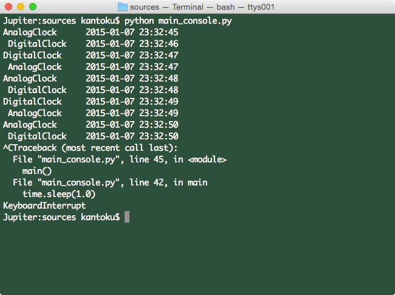
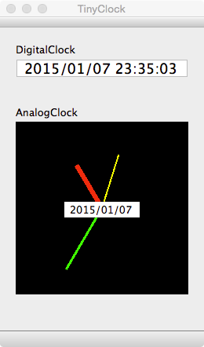

DesignPattern - ObserverPattern
====================

#[オーブサーバーパターン](./ReadMe/Observer-Pattern.md)
デザインパターンのオブザーバーパターンを時計アプリへの適用例をPythonコードで示す。  
デジタル時計とアナログ時計を表示するアプリを作成した。  
このアプリをTinyClockと呼ぶこととする。  
TinyClockはConsole版とGUI版がある。  
GUI版はPyQtを使用している為、PyQtをインストールしている必要がある。  

-------------------------------------------------

#[TinyClock（console版）](./ReadMe/TinyClock-console.md)
TinyClock(console版)を実行するにはコマンドラインから以下を実行する。  

	%python ./sources/main_console.py  

(プログラムは無限ループになっているので、C-cで強制終了。)   

-------------------------------------------------

#[TinyClock(GUI版)](./ReadMe/TinyClock-GUI.md)
	
TinyClock(GUI版)を実行するにはコマンドラインから以下を実行する。  

	%python ./sources/main_GUI.py  

-------------------------------------------------

#ディレクトリ構成
ディレクトリ構成を以下に示す。

.  
├── README.md					// 本ファイル  
├── UML  
│   ├── TinyClock.asta			// UML astahファイル  
│   └── img						// atashファイルを画像にした  
│  
└── sources						// ソースコードファイルを保存したディレクトリ  
    ├── Lib  
    │   └──  Observer.py		// Observerパターン Pythonソースコード  
    │  
    ├── Model  
    │   ├── Lib -> ../Lib		// シンボリックリンク(１つ上のディレクトリのLib)  
    │   └── TinyClockModel.py	// 時計本体部 Pythonソースコード  
    │  
    ├── View  
    │   ├── GUI					// GUI mainwindow.ui以外使用しない  
    │   │   ├── GUI.pro			// Qt Creatorファイル  
    │   │   ├── GUI.pro.user  
    │   │   ├── main.cpp  
    │   │   ├── mainwindow.cpp  
    │   │   ├── mainwindow.h  
    │   │   └── mainwindow.ui	// GUI メインウィンドウ XML（Qt Creatorで自動生成される）      
    │   │  
    │   ├── Lib -> ../Lib		// シンボリックリンク(１つ上のディレクトリのLib)  
    │   ├── TinyClockView.py	// 時計表示部（データ保持）  
    │   ├── TinyClockViewGUI.py	// 時計表示部（GUI）  
    │   └── mainwindow.py		// mainwindow.uiをPythonソースコードへ変換したもの  
    │  
    ├── main_console.py			// コンソール用 main関数（本ファイルをpythonで実行するとコンソールに時刻を表示する）  
    └── main_gui.py				// GUI用 main関数（本ファイルをpythonで実行するとデジタル時計とアナログ時計をGUI表示する）  

