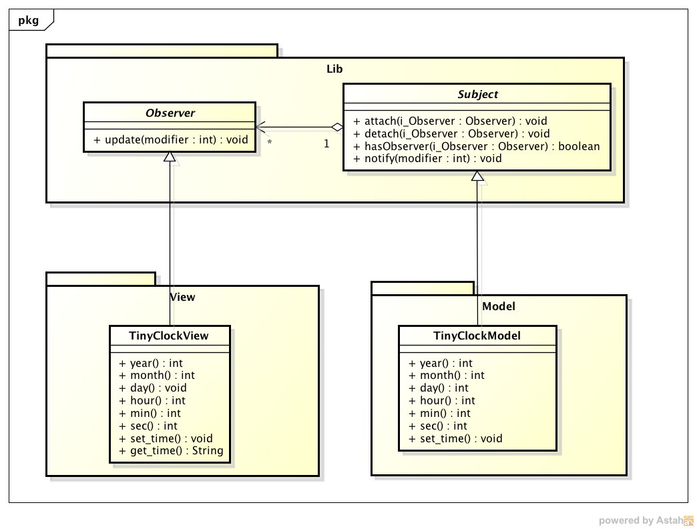

DesignPattern - ObserverPattern
====================
#概要
デザインパターンのオブザーバーパターンを時計アプリへの適用例をPythonコードで示す。  
デジタル時計とアナログ時計を表示するアプリを作成した。  
このアプリをTinyClockと呼ぶこととする。  
TinyClockはConsole版とGUI版がある。  
GUI版はPyQtを使用している為、PyQtをインストールしている必要がある。  

-------------------------------------------------

#デザインパターンのオブザーバーパターンメモ

* オブザーバーパターンを使用すると疎結合なアプリケーションを作成可能。 
　(GUIのアプリケーションでよく使用されている。)
* オブザーバーパターンは、「通知者」から「観測者」に状態を通知する。
* オブザーバーパターンのメリットとしては、観測者は通知を受け取った場合に動作する。
　(ポーリングしなくともよい。)
* 通知者をSubjectクラス、観測者をObserverクラスとする。
* Subjectクラスは、Observerクラスを持つ。
* Subjectクラスは、Observerクラスを複数持ってもよい。この場合、SubjectクラスはすべてのObserverクラスへ通知を行う。

##オブザーバーパターン Pythonソースコード
###Observerクラス
[Observerクラス](./sources/Lib/Observer.py)
* Observerクラスは、Subjectクラスから通知を受け取るクラス。
* Observerクラスは抽象クラスの為、インスタンスは作成しないこと。
* Subjectクラスからの通知は、updateメソッドで受け取る。
* updateメソッドは、継承したクラスでオーバーライドする。
```Python
class Observer(object):
    """
    @brief  オブザーバークラス.
            更新があった場合, Subjectから通知を受け取るクラス.
    @note   抽象クラス. インスタンスは作成しないこと.    
    """

    def update(self, modifier=None):
        """
        @brief  Subjetから通知を受け取るメソッド.
        @param  modifier    更新情報.
        @note   本メソッドは継承したクラスでオーバーライドすること.
        """
        raise NotImplementedError
```

###Subjectクラス(一部抜粋)
[Subjectクラス](./sources/Lib/Observer.py)
* Subjectクラスは、登録されているObserverクラス全てに通知をする。
* Observerクラスを登録するには、attachメソッドを使用する。
* Observerクラスに通知するには、notifyメソッドを使用する。
```Python
class Subject(object):
    """
    @brief  サブジェクトクラス.
            更新があった場合, Observerへ通知するクラス.
    """

    def __init__(self):
        """
        @brief  初期化.
        @param  メンバー変数 self._observerList 登録されたオブザーバーリスト.   
        """
        self._observerList = []

    def attach(self, observer):
        """
        @brief    Observerを登録する.
        @param    observer 登録するオブザーバー.
        @return   なし.
        """
        if not observer in self._observerList:
            self._observerList.append(observer)

    def notify(self, modifier=None):
        """
        @brief  Observerへ更新を通知するメソッド.
        @param  modifier    更新情報.
        """
        for observer in self._observerList:
            if observer != modifier:
                observer.update(self)

```


-------------------------------------------------

#実行イメージ
##TinyClock console版
以下を実行する  
$python ./sources/main_console.py  
(無限ループになってるので、気が済んだらC-c)   


##TinyClock GUI版
以下を実行する  
$python ./sources/main_GUI.py  


-------------------------------------------------

#ディレクトリ構成
ディレクトリ構成を以下に示す。

.  
├── README.md					// 本ファイル  
├── UML  
│   ├── TinyClock.asta			// UML astahファイル  
│   └── img						// atashファイルを画像にした  
│  
└── sources						// ソースコードファイルを保存したディレクトリ  
    ├── Lib  
    │   └──  Observer.py		// Observerパターン Pythonソースコード  
    │  
    ├── Model  
    │   ├── Lib -> ../Lib		// シンボリックリンク(１つ上のディレクトリのLib)  
    │   └── TinyClockModel.py	// 時計本体部 Pythonソースコード  
    │  
    ├── View  
    │   ├── GUI					// GUI mainwindow.ui以外使用しない  
    │   │   ├── GUI.pro			// Qt Creatorファイル  
    │   │   ├── GUI.pro.user  
    │   │   ├── main.cpp  
    │   │   ├── mainwindow.cpp  
    │   │   ├── mainwindow.h  
    │   │   └── mainwindow.ui	// GUI メインウィンドウ XML（Qt Creatorで自動生成される）      
    │   │  
    │   ├── Lib -> ../Lib		// シンボリックリンク(１つ上のディレクトリのLib)  
    │   ├── TinyClockView.py	// 時計表示部（データ保持）  
    │   ├── TinyClockViewGUI.py	// 時計表示部（GUI）  
    │   └── mainwindow.py		// mainwindow.uiをPythonソースコードへ変換したもの  
    │  
    ├── main_console.py			// コンソール用 main関数（本ファイルをpythonで実行するとコンソールに時刻を表示する）  
    └── main_gui.py				// GUI用 main関数（本ファイルをpythonで実行するとデジタル時計とアナログ時計をGUI表示する）  


-------------------------------------------------


#UML
オブザーバーパターン、及び、TinyClockのUMLを作成した。  
[UML](./UML/TinyClock.asta)

UMLはastahで作成している。  
astahは以下からダウンロード可能。  
[astah](http://astah.change-vision.com/ja/)  

astahで作成したUMLをpngに変換した。
オブザーバーパターン、及び、TinyClockのUMLを以下図に示す。  

##オブザーバーパターン
###クラス図


##TinyClock console版
###クラス図

###シーケンス図


##TinyClock GUI版
###クラス図

###シーケンス図

