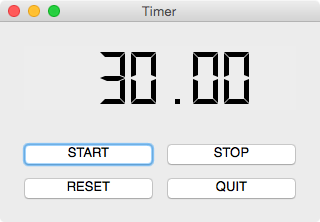
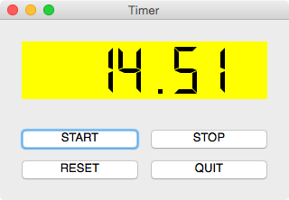
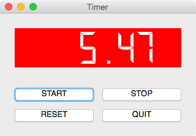
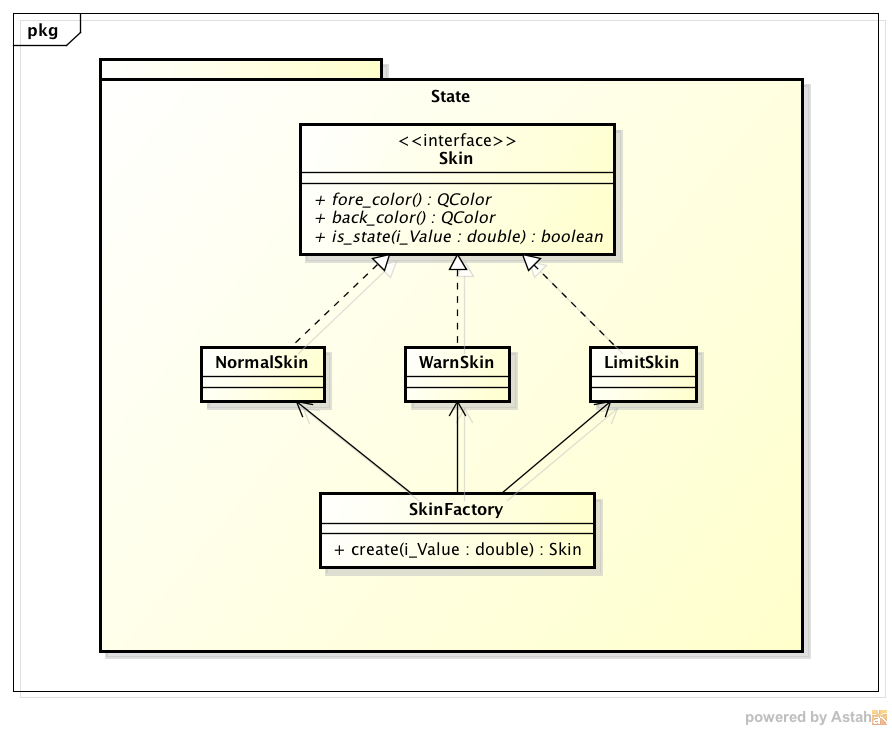

DesignPattern - StatePattern
====================

#概要
デザインパターンのステートパターンをタイマーアプリへの適用例をPythonコードで示す。  
PyQtを使用している為、PyQtをインストールしている必要がある。  

-------------------------------------------------

#ステートパターン

##目的
内部状態を判断し, 処理を変更したい場合がある.  
内部状態が複数あった場合, 条件分岐が複雑となってしまう.  
この時, デザインパターンのステートパターンを利用すると複雑な条件分岐を無くすことが可能となる.  

##パターン適用
タイマーアプリにステートパターンを適用する.  
タイマーアプリとは, 時間と共に数値をカウントダウンしていくアプリである.  
内部状態を以下ののように定める.

- Normal: 数値が100%〜50%
- Warn: 数値が50%〜20%
- Limit: 数値が20%〜0%

タイマーアプリでは各状態に対して, 前景色／背景色を変更する.  
各状態をタイマーアプリで表現した場合のイメージ図を以下に示す.  

- Normal状態のイメージ図

- Warn状態のイメージ図

- Limit状態のイメージ図

##クラス図
各状態をあらわすクラスを以下のように定義する.  

- NomalSkin
- WarnSkin
- LimitSkin

上記クラスはSkinクラスを継承する.  
Skinクラスはインフェースとし, インスタンス化はしない.  

各状態を生成するクラスSkinFactoryを設ける.  
パッケージState外からは以下クラス通じて各状態にアクセスする.  

- SkinFactory
- Skin

以下にクラス図を示す.  

